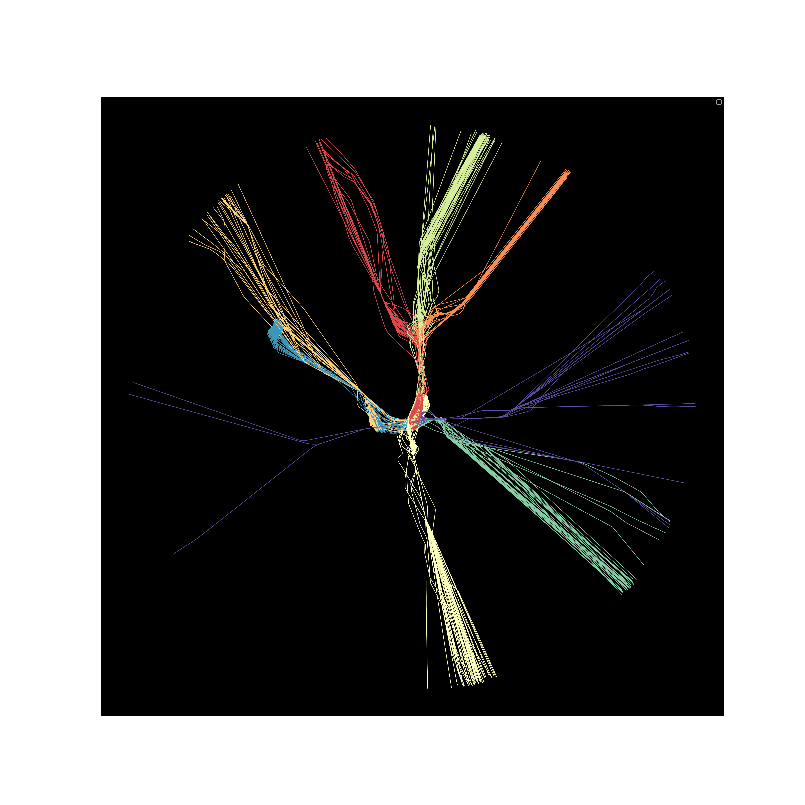

# atc
Master Thesis - Trajectories Analysis

How to run

```

change <path-to> to absolute path to atc repo on your local
export PYTHONPATH="$PYTHONPATH:<path-to>/atc/"
```

```
cd atc/trajclus

To plot density traffic toward the airport

python apps/traffic_density_plot.py --input_path ~/data/tracks_2016_09.csv --airport_code WSSS

```

```

To cluster traffic toward the airport

python apps/lsh_clustering.py --input_path ~/data/tracks_2016_09.csv --airport_code WSSS --filter_date 2016-09-29


```




Logs and results will be save under atc/tmp directory


Dependencies

```

pip install -r requirements.txt

# skip this, old for Python2
pip install -U git+https://github.com/maikol-solis/trajectory_distance.git

```